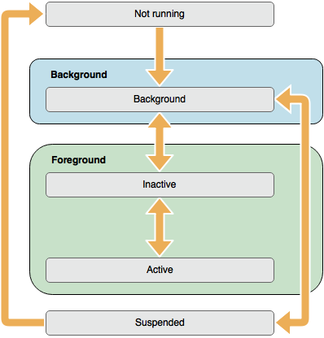

#Check Point Mobile SDK for iOS

The Check Point Mobile SDK (CPMobileSDK) for iOS is an advanced framework for integrating iOS apps securely and effortlessly with <a href="https://itunes.apple.com/us/app/capsule-workspace/id522091441?mt=8" target="_blank">Check Point Capsule Workspace</a>.

By integrating with Capsule Workspace, apps benefit from the following advantages:

* Secure access to corporate network resources
* Passcode protection
* Mobile policy enforcement, such as secure pasteboard (copy&paste), document interaction, etc.

##Overview

Normally, iOS apps are in one of the following states: not running, background, inactive, active, suspended. The system moves the app from state to state in response to actions happening throughout the system. For example, when the user presses the Home button, a phone call comes in, or any of several other interruptions occurs, the currently running apps change state in response. 



When integrating, the normal states change to accommodate the need for user unlock the application and the system's need to obtain the encryption keys from Capsule Workspace.


When application first starts, it starts in a lock state and does not have the encryption key. After user authenticates with Capsule Workspace, the system obtains the encryption key from Capsule Workspace and unlocks the user interface. At this point, the application can become either active or inactive, depending on system considerations. Once an application moves to background, its UI is locked (but the encryption key remains in memory). Moving the application to foreground will trigger check with Capsule Workspace if user authentication is necessary; if not, it will be unlocked immediately, otherwise the user will be presented with authentication screen.

Under some cases, the encryption key may be removed from the system when Capsule Workspace indicates such need. In such case the application should stop all I/O operations until an encryption key is available again.

App state transitions are accompanied by corresponding notifications. These notifications can be used to respond to state changes in an appropriate way. These notifications are listed below, along with a summary of how they might be used.

| Notification Name | Description |
| :--- | :---|
| `CPMobileSDKEncryptionKeyAvailableNotification` | Posted when the encryption key becomes available, once the user has authenticated with Capsule Workspace. Use the `CPMobileSDKEncryptionKeyUserInfoKey` user info key to obtain the encryption key, or use the `CPMobileSDK.encryptionKey()` method. |
| `CPMobileSDKEncryptionKeyUnavailableNotification` | Posted when the encryption key becomes unavailable, usually if user has logged out in Capsule Workspace, or some other issue has come up and requires the user’s reauthentication. |
| `CPMobileSDKDidUnlockApplicationNotification` | Posted when the application is unlocked. |
| `CPMobileSDKDidLockApplicationNotification` | Posted when the application is locked. |

##Integration

The framework can be used with both Objective–C and Swift projects.

###Perquisites

Please read the <a href="http://secureupdates.checkpoint.com/mobile/Capsule/Check Point Mobile App Wrapping Guide (1.04).pdf" target="_blank">Check Point App Wrapping Guide</a> for information how to configure Capsule Workspace to work with wrapped and SDK–integrated apps.

###Xcode Project Integration

Drag `CPMobileSDK.framework` to your project, and add `CPMobileSDK.framework` to **Embedded Binaries** in your project target's **General** tab. Xcode should sort everything else on its own.

In your code, import the framework.

```swift
import CPMobileSDK
```

```objc
@import CPMobileSDK;
```

For Objective–C projects without module support, import the framework's umbrella header:

```objc
#import <CPMobileSDK/CPMobileSDK.h>
```

In order for Capsule Workspace to be able to provide information back to the app, a URL scheme and an SDK app identifier needs to be added to the app's Info.plist. It is recommended to use the app's bundle identifier for these.

In your project, add a URL type like so:

| Key | Value |
| :--- | :---|
| Identifier | `$(PRODUCT_BUNDLE_IDENTIFIER).url` |
| URL Schemes | `cpsetsitedata$(PRODUCT_BUNDLE_IDENTIFIER)` |
| Icon | None |
| Role | Viewer |


In your Info.plist file, add a new row, with the following data:

| Key | Type | Value |
| --- | --- | --- |
| CPMobileSDKAppID | String | `$(PRODUCT_BUNDLE_IDENTIFIER)` |


###Code Integration

Integration can be achieved in two methods. There are demo projects for each.

####Quick Integration

Call the `CPMobileSDKApplicationMain(_:_:_:_:_:)` function in your `main` file/function implementation. This is a convenience function for integrating with the SDK with minimal effort. Internally, `CPMobileSDK.startSDKWithOptions(_:)` is called to start the SDK with the provided options. Once the system is ready and the user has unlocked the application, the application delegate will start receiving normal application life cycle method calls.

Swift applications don't normally include a main file. Instead, they are generated using the `@UIApplicationMain` attribute. For example:

```swift
@UIApplicationMain //Remove this attribute
class AppDelegate: UIResponder, UIApplicationDelegate {
}
```

Remove this attribute and create a new Swift file named "main.swift" (it must have this exact name). In the new file, add the following call:

```swift
import CPMobileSDK

CPMobileSDKApplicationMain(Process.argc, Process.unsafeArgv, nil, NSStringFromClass(AppDelegate), CPMobileSDKOptions())
```

Objective–C applications normally include a main.m file with a `main` function. Modify this method to call `CPMobileSDKApplicationMain` like so:

```objc
@import CPMobileSDK;

int main(int argc, char * argv[])
{
	@autoreleasepool
	{
		return CPMobileSDKApplicationMain(argc, argv, nil, NSStringFromClass([BrowSecAppDelegate class]), [CPMobileSDKOptions new]);
	}
}
```

Advantages 

* Quick and easy integration with most of the SDK's features
* Requires very little changes to existing code
* Should be enough for most projects

Disadvantages

* Limited control over SDK operation
* Might change critical application flows

####Manual Integration

For full control of the SDK integration, the app needs to be aware of the flows of the SDK, and prepare its logic accordingly.

Early on, add observers for at least `CPMobileSDKEncryptionKeyAvailableNotification` and `CPMobileSDKDidUnlockApplicationNotification`. Start the SDK by calling `CPMobileSDK.startSDKWithOptions(_:)` like so:

```swift
func application(application: UIApplication, didFinishLaunchingWithOptions launchOptions: [NSObject: AnyObject]?) -> Bool {
	// Override point for customization after application launch.
	NSNotificationCenter.defaultCenter().addObserver(self, selector: #selector(mobileSDKEncryptionKeyAvailable), name: CPMobileSDKEncryptionKeyAvailableNotification, object: nil)
	NSNotificationCenter.defaultCenter().addObserver(self, selector: #selector(mobileSDKDidUnlockApplication), name: CPMobileSDKDidUnlockApplicationNotification, object: nil)
		
	CPMobileSDK.startSDKWithOptions(nil)
		
	return true
}
	
internal func mobileSDKEncryptionKeyAvailable(note: NSNotification) {
	if let encryptionKey = note.userInfo?[CPMobileSDKEncryptionKeyUserInfoKey] as? NSData {
		//Use encryption key to start I/O related API.
	}
}

internal func mobileSDKDidUnlockApplication(note: NSNotification) {
	//Present the app's UI here if not already presented.
}
```

```objc
- (BOOL)application:(UIApplication *)application didFinishLaunchingWithOptions:(NSDictionary *)launchOptions {
	// Override point for customization after application launch.
	[[NSNotificationCenter defaultCenter] addObserver:self selector:@selector(_mobileSDKEncryptionKeyAvailable:) name:CPMobileSDKEncryptionKeyAvailableNotification object:nil];
	[[NSNotificationCenter defaultCenter] addObserver:self selector:@selector(_mobileSDKDidUnlockApplication:) name:CPMobileSDKDidUnlockApplicationNotification object:nil];
	
	[CPMobileSDK startSDKWithOptions:nil];
	
	return YES;
}

- (void)_mobileSDKEncryptionKeyAvailable:(NSNotification*)note
{
	NSData* encryptionKey = note.userInfo[CPMobileSDKEncryptionKeyUserInfoKey];
	
	//Use encryption key to start I/O related API.
}

- (void)_mobileSDKDidUnlockApplication:(NSNotification*)note
{
	//Present the app's UI here.
}
```

UI can be presented before the application is unlocked by the SDK, but this may cause unexpected results, such as starting network requests or disk access. It is best to present the UI only once the application is first unlocked. For projects which start their UI in code, this is very simple – move the UI code to the `CPMobileSDKDidUnlockApplicationNotification` observer method. For UI loaded from a Storyboard or a NIB/XIB, the simplest solution is to introduce a landing view controller, and present the real UI in the `CPMobileSDKDidUnlockApplicationNotification` observer method. The included demo project demonstrates how to achieve this.

Once the application is locked, it is generally safe to operate the UI normally, even if hidden. However, it is advised to close all work and discard the UI once a `CPMobileSDKEncryptionKeyUnavailableNotification` notification is posted.

Advantages 

* Complete control over the application workflows
* Allows performing some tasks which may not require security, while limiting security tasks once the user authenticates

Disadvantages

* Requires more understanding of the SDK
* May require some changes to existing code to accommodate SDK requirements

##Planed SDK Features

In the future, the following features are planned:

* File encryption
* Drop–in secure Core Data subclasses
* Drop–in secure SQLite
* Project integration using <a href="https://github.com/Carthage/Carthage" target="_blank">Carthage</a>